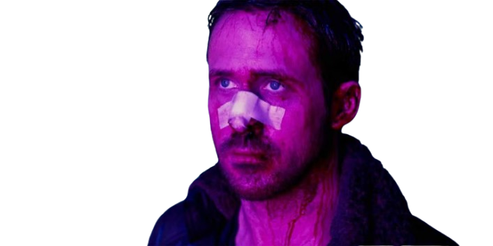

# Hey, I'm Welsh Muhuri ♦

  

    <!---->
    <!--
    
    -->
  

  

    <strong>Computer Science student | AI | Cyber Security Enthusiast</strong>  
    I'm passionate about <strong>ethical hacking</strong>, <strong>network defense</strong>, and writing code that actually <em>does something cool</em>.  
    Currently working at GrowPick Limited as a Cyber Security Specialist.
  

---

## Tech Stack

### Programming Languages

### Tools & Platforms

---

## Currently Exploring
- **Penetration Testing** & real-world attack simulations  
- **Cybersecurity automation** with Python & Bash  
- **Full-stack development** (Node.js + React)  
- **Network Security & Wireless Hacking** basics
- **Building fun tools with Rust**. Rust is underrated honestly
- **Python Art**

---

## Interests
- Ethical Hacking & Vulnerability Research  
- Open-source contributions (building tools for devs + hackers)  
- Creating security-focused apps and CLIs  
- Building writeups to guide other cybersecurity enthusiasts
- Creating indie games. I have only created one game; Dodge the Creeps (it's in godot-docs)
- Perfume collection

---

## GitHub Stats

---

## Connect with Me
  
  
  

## TryHackMe

  

    
  

---

  

    
    
  

---

## CryptoCurrency

---

*“Code is law. And Hackers are the Law Makers.”*  
*"Say No to Vibe Coding"*

